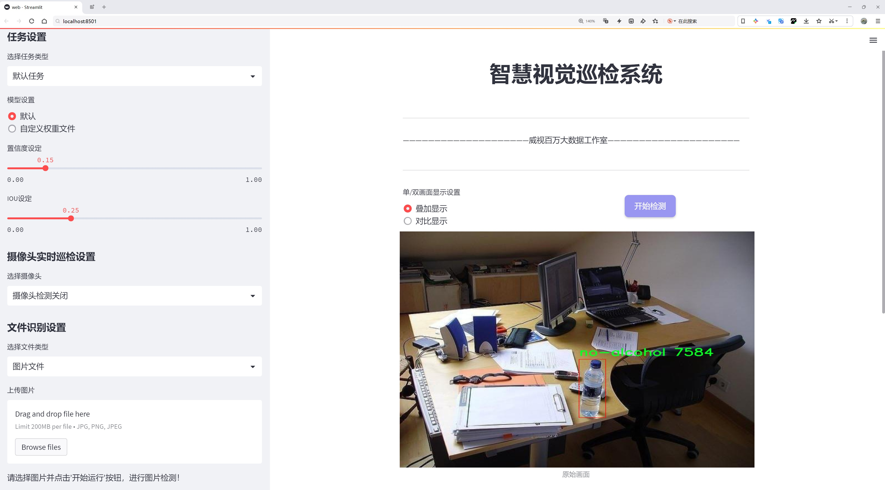
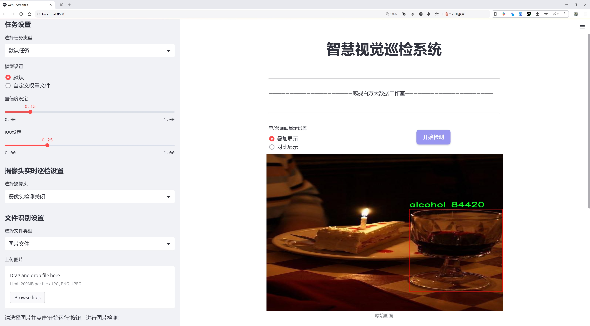
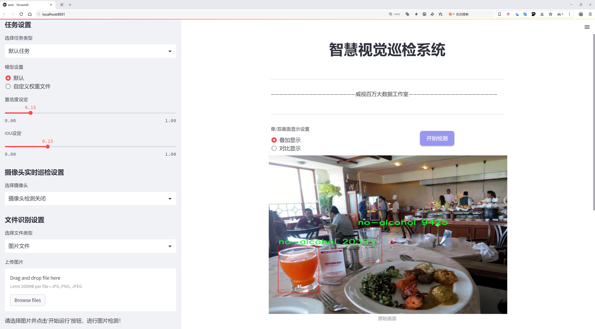
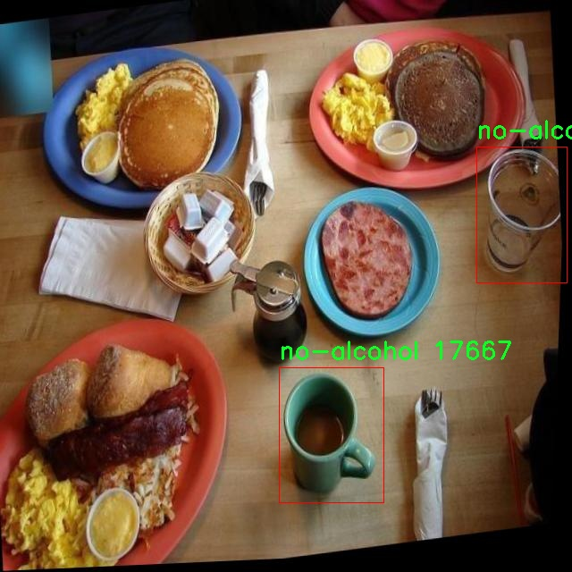
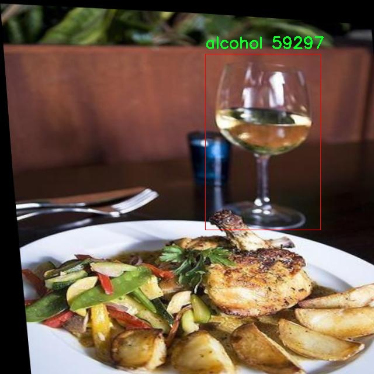
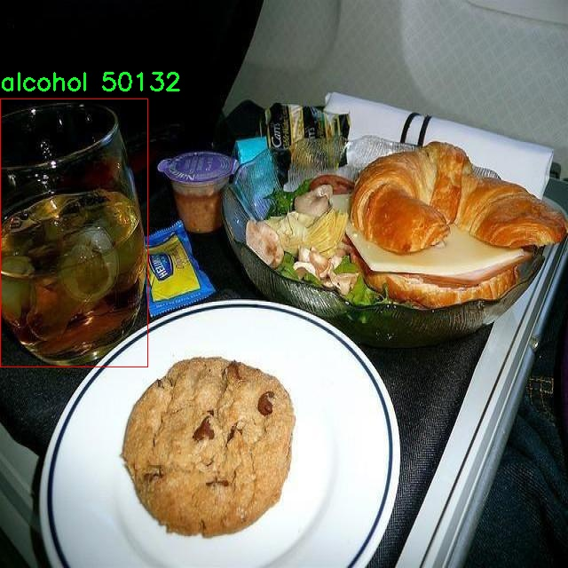
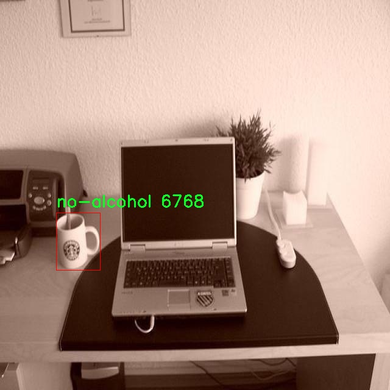
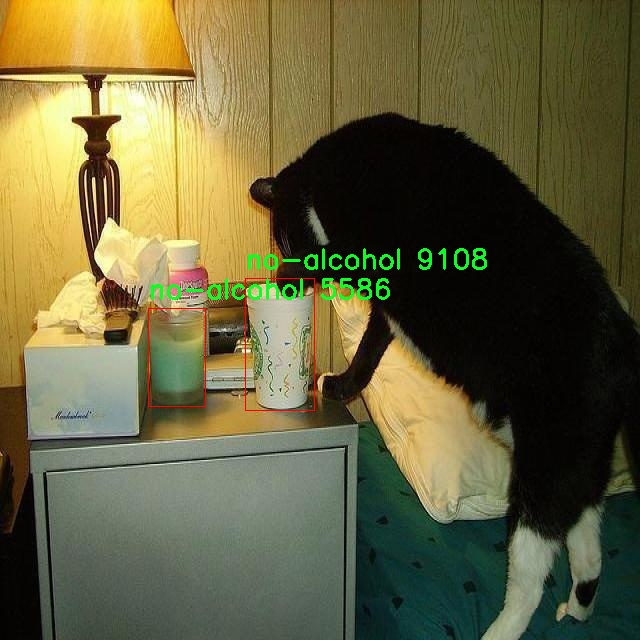

# 是否含有酒精检测检测系统源码分享
 # [一条龙教学YOLOV8标注好的数据集一键训练_70+全套改进创新点发刊_Web前端展示]

### 1.研究背景与意义

项目参考[AAAI Association for the Advancement of Artificial Intelligence](https://gitee.com/qunshansj/projects)

项目来源[AACV Association for the Advancement of Computer Vision](https://gitee.com/qunmasj/projects)

研究背景与意义

随着社会经济的发展和人们生活水平的提高，酒精消费在全球范围内逐渐增加，随之而来的酒后驾驶、酗酒等问题也日益严重。这不仅对个人的健康构成威胁，更对公共安全造成了极大的隐患。因此，开发高效、准确的酒精检测系统显得尤为重要。传统的酒精检测方法多依赖于人工操作，存在效率低、误差大等问题，难以满足现代社会对快速、准确检测的需求。近年来，计算机视觉技术的快速发展为酒精检测提供了新的思路，尤其是基于深度学习的目标检测算法，展现出了优越的性能。

YOLO（You Only Look Once）系列算法因其高效的实时检测能力而受到广泛关注。YOLOv8作为该系列的最新版本，进一步提升了检测精度和速度，成为目标检测领域的重要工具。通过对YOLOv8的改进，可以更好地适应酒精检测的需求。具体而言，改进后的YOLOv8可以通过分析图像中的特征，快速判断物体是否含有酒精，从而实现对酒精产品的实时监测和识别。

本研究所使用的数据集包含3000张图像，分为“含酒精”和“不含酒精”两个类别。这一数据集的构建为模型的训练和验证提供了基础，确保了模型在实际应用中的有效性和可靠性。通过对该数据集的深入分析，可以挖掘出酒精与非酒精物品在视觉特征上的差异，从而为模型的优化提供依据。此外，数据集的规模和多样性也为模型的泛化能力奠定了基础，使其能够在不同场景下保持较高的检测准确率。

研究的意义不仅在于技术层面的创新，更在于其对社会的积极影响。通过构建基于改进YOLOv8的酒精检测系统，可以有效降低酒后驾驶等违法行为的发生率，提升公共安全。同时，该系统还可以应用于商超、酒吧等场所，帮助商家实时监控酒精产品的销售情况，防止未成年人购买酒精饮品，促进社会的健康发展。

综上所述，基于改进YOLOv8的酒精检测系统的研究，不仅具有重要的学术价值，更具备广泛的社会应用前景。通过深入探讨这一主题，期望能够为酒精检测技术的发展提供新的思路和方法，推动相关领域的研究进展，为构建更加安全、健康的社会贡献力量。

### 2.图片演示







##### 注意：由于此博客编辑较早，上面“2.图片演示”和“3.视频演示”展示的系统图片或者视频可能为老版本，新版本在老版本的基础上升级如下：（实际效果以升级的新版本为准）

  （1）适配了YOLOV8的“目标检测”模型和“实例分割”模型，通过加载相应的权重（.pt）文件即可自适应加载模型。

  （2）支持“图片识别”、“视频识别”、“摄像头实时识别”三种识别模式。

  （3）支持“图片识别”、“视频识别”、“摄像头实时识别”三种识别结果保存导出，解决手动导出（容易卡顿出现爆内存）存在的问题，识别完自动保存结果并导出到tempDir中。

  （4）支持Web前端系统中的标题、背景图等自定义修改，后面提供修改教程。

  另外本项目提供训练的数据集和训练教程,暂不提供权重文件（best.pt）,需要您按照教程进行训练后实现图片演示和Web前端界面演示的效果。

### 3.视频演示

[3.1 视频演示](https://www.bilibili.com/video/BV1Ec4ae2Eu4/)

### 4.数据集信息展示

##### 4.1 本项目数据集详细数据（类别数＆类别名）

nc: 2
names: ['alcohol', 'no-alcohol']


##### 4.2 本项目数据集信息介绍

数据集信息展示

在本研究中，我们采用了名为“Alcohol detection”的数据集，以支持对YOLOv8模型的改进，特别是在酒精检测系统的训练与评估方面。该数据集的设计旨在提供一个高效且可靠的基础，以便于深度学习模型能够准确识别和分类含酒精与不含酒精的物品。数据集的类别数量为2，具体类别包括“alcohol”和“no-alcohol”，这为模型的训练提供了清晰的目标和方向。

“Alcohol detection”数据集的构建过程经过精心设计，确保了数据的多样性和代表性。数据集中包含了大量的图像样本，这些样本涵盖了不同类型的酒精饮品以及与之相对的非酒精饮品。通过这种方式，数据集不仅能够帮助模型学习到酒精饮品的特征，还能有效地减少误判的可能性，从而提高模型的整体准确性和鲁棒性。

在数据采集阶段，研究团队广泛收集了各种环境下的图像，包括超市货架、酒吧、家庭聚会等场景。这些场景的多样性使得模型在实际应用中能够更好地适应不同的环境和条件。此外，数据集中的图像经过了精细的标注，确保每个样本都准确地反映了其所属的类别。这种高质量的标注工作为后续的模型训练提供了坚实的基础。

为了进一步增强数据集的有效性，研究团队还采用了数据增强技术。通过对原始图像进行旋转、缩放、裁剪和颜色调整等操作，生成了多样化的训练样本。这不仅增加了数据集的规模，还提高了模型的泛化能力，使其能够在面对未见过的样本时依然保持良好的性能。

在模型训练过程中，YOLOv8的改进主要集中在特征提取和分类精度的提升上。通过利用“Alcohol detection”数据集，模型能够在短时间内学习到酒精与非酒精物品的关键特征。这一过程不仅依赖于数据集的丰富性，还得益于YOLOv8本身的高效架构，使得模型能够在实时检测中实现快速响应。

此外，数据集的评估机制也十分重要。通过在验证集上进行严格的测试，研究团队能够实时监控模型的性能表现，及时调整训练策略。这种动态的反馈机制确保了模型在训练过程中的持续优化，最终实现了对酒精检测的高准确率和低误报率。

综上所述，“Alcohol detection”数据集为改进YOLOv8模型在酒精检测系统中的应用提供了强有力的支持。通过高质量的样本、多样化的场景以及有效的数据增强策略，该数据集不仅提升了模型的学习效率，也为未来的研究和应用奠定了坚实的基础。随着技术的不断进步，我们期待该数据集能够在更广泛的领域中发挥其重要作用，为酒精检测和相关研究提供更多的可能性。











### 5.全套项目环境部署视频教程（零基础手把手教学）

[5.1 环境部署教程链接（零基础手把手教学）](https://www.ixigua.com/7404473917358506534?logTag=c807d0cbc21c0ef59de5)


[5.2 安装Python虚拟环境创建和依赖库安装视频教程链接（零基础手把手教学）](https://www.ixigua.com/7404474678003106304?logTag=1f1041108cd1f708b01a)

### 6.手把手YOLOV8训练视频教程（零基础小白有手就能学会）

[6.1 手把手YOLOV8训练视频教程（零基础小白有手就能学会）](https://www.ixigua.com/7404477157818401292?logTag=d31a2dfd1983c9668658)

### 7.70+种全套YOLOV8创新点代码加载调参视频教程（一键加载写好的改进模型的配置文件）

[7.1 70+种全套YOLOV8创新点代码加载调参视频教程（一键加载写好的改进模型的配置文件）](https://www.ixigua.com/7404478314661806627?logTag=29066f8288e3f4eea3a4)

### 8.70+种全套YOLOV8创新点原理讲解（非科班也可以轻松写刊发刊，V10版本正在科研待更新）

由于篇幅限制，每个创新点的具体原理讲解就不一一展开，具体见下列网址中的创新点对应子项目的技术原理博客网址【Blog】：


[8.1 70+种全套YOLOV8创新点原理讲解链接](https://gitee.com/qunmasj/good)

### 9.系统功能展示（检测对象为举例，实际内容以本项目数据集为准）

图9.1.系统支持检测结果表格显示

  图9.2.系统支持置信度和IOU阈值手动调节

  图9.3.系统支持自定义加载权重文件best.pt(需要你通过步骤5中训练获得)

  图9.4.系统支持摄像头实时识别

  图9.5.系统支持图片识别

  图9.6.系统支持视频识别

  图9.7.系统支持识别结果文件自动保存

  图9.8.系统支持Excel导出检测结果数据


### 10.原始YOLOV8算法原理

原始YOLOv8算法原理

YOLOv8，作为2023年1月发布的最新一代目标检测模型，标志着计算机视觉领域的又一次重大进步。它在分类、检测和分割任务中展现出了卓越的性能，超越了以往所有已知的模型。YOLOv8不仅在精度上取得了显著提升，同时在执行时间上也展现出了优越性，成为了YOLO系列中的新王者。该模型在设计上吸取了YOLOv5、YOLOv6、YOLOX等前辈模型的优点，尤其是在模型结构的改进上，进一步提升了YOLOv5的基础，同时保持了其工程化的简洁易用性。

YOLOv8的核心创新在于其全新的骨干网络、Anchor-Free检测头以及优化的损失函数。这些创新使得YOLOv8能够在多种硬件平台上高效运行，从CPU到GPU均可实现流畅的性能。具体而言，YOLOv8在多个方面进行了重要的改进。例如，第一个卷积层的卷积核由6x6缩小至3x3，这一变化有效减少了计算复杂度，并提升了特征提取的效率。此外，所有的C3模块被替换为C2f模块，这一模块通过增加跳层连接和Split操作，增强了特征的流动性，进而提高了模型的学习能力。

在Backbone结构方面，YOLOv8依然采用了YOLOv5的CSPDarknet设计理念，但在具体实现上进行了优化。C2f模块的引入，不仅提升了模型的轻量化特性，还在不牺牲检测精度的前提下，增强了特征提取的能力。C2f模块的设计灵感来源于YOLOv7的ELAN思想，通过引入多个分支和Bottleneck结构，确保了特征信息的丰富性和梯度流的畅通。这种设计有效地缓解了深层网络中的梯度消失问题，使得模型在训练过程中更加稳定。

在特征融合层，YOLOv8采用了PAN-FPN结构，能够充分融合多尺度信息。这一结构的设计使得浅层特征、中层特征和高层特征之间的融合更加高效，进而提升了目标检测的准确性。通过自下而上的融合方式，YOLOv8能够在高层特征中引入中层和浅层特征的信息，从而增强了对细节信息的捕捉能力。

YOLOv8的检测头部分是其最显著的变化之一。传统的Anchor-Based检测方法被Anchor-Free的设计所取代，这一转变不仅简化了模型的结构，还提高了目标检测的灵活性。YOLOv8的解耦头结构将分类和回归分支分开处理，利用Distribution Focal Loss和CIoU Loss作为损失函数，确保了模型在面对小目标和复杂场景时的高效性和准确性。

为了进一步提升模型的性能，YOLOv8在样本匹配策略上进行了创新，将静态匹配改为Task-Aligned的Assigner匹配方式。这一变化使得模型在训练过程中能够更好地适应不同类型的目标，提高了检测的准确性和鲁棒性。

在数据预处理方面，YOLOv8延续了YOLOv5的策略，采用了多种数据增强手段，如马赛克增强、混合增强、空间扰动和颜色扰动等。这些增强手段的引入，不仅丰富了训练数据的多样性，还有效提升了模型的泛化能力。

综上所述，YOLOv8通过对骨干网络、特征融合层和检测头的全面改进，结合先进的损失函数和数据处理策略，成功地提升了目标检测的精度和速度。它不仅在理论上为目标检测领域提供了新的思路，也在实际应用中展现出了广泛的适用性和优越的性能。随着YOLOv8的推出，目标检测技术将迎来新的发展机遇，为各类应用场景提供更为强大的支持。


### 11.项目核心源码讲解（再也不用担心看不懂代码逻辑）

#### 11.1 ui.py

以下是代码的核心部分，并添加了详细的中文注释：

```python
import sys  # 导入sys模块，用于访问与Python解释器紧密相关的变量和函数
import subprocess  # 导入subprocess模块，用于执行外部命令

def run_script(script_path):
    """
    使用当前 Python 环境运行指定的脚本。

    Args:
        script_path (str): 要运行的脚本路径

    Returns:
        None
    """
    # 获取当前 Python 解释器的路径
    python_path = sys.executable

    # 构建运行命令，使用streamlit运行指定的脚本
    command = f'"{python_path}" -m streamlit run "{script_path}"'

    # 执行命令，并等待其完成
    result = subprocess.run(command, shell=True)
    
    # 检查命令执行的返回码，如果不为0，表示出错
    if result.returncode != 0:
        print("脚本运行出错。")

# 实例化并运行应用
if __name__ == "__main__":
    # 指定要运行的脚本路径
    script_path = "web.py"  # 这里假设脚本在当前目录下

    # 调用函数运行脚本
    run_script(script_path)
```

### 代码分析：
1. **导入模块**：
   - `sys`模块用于获取当前Python解释器的路径。
   - `subprocess`模块用于在Python中执行外部命令。

2. **`run_script`函数**：
   - 该函数接收一个脚本路径作为参数，并使用当前Python环境运行该脚本。
   - 通过`sys.executable`获取当前Python解释器的路径。
   - 构建一个命令字符串，使用`streamlit`模块运行指定的脚本。
   - 使用`subprocess.run`执行命令，并检查返回码以判断脚本是否成功运行。

3. **主程序块**：
   - 在主程序块中，指定要运行的脚本路径（这里假设为`web.py`）。
   - 调用`run_script`函数来执行该脚本。 

### 注意事项：
- 该代码假设`web.py`脚本位于当前工作目录中，实际使用时需要根据情况调整路径。
- `streamlit`需要在当前Python环境中安装并可用。

这个文件是一个 Python 脚本，主要用于运行一个名为 `web.py` 的 Streamlit 应用。首先，文件引入了一些必要的模块，包括 `sys`、`os` 和 `subprocess`，这些模块分别用于处理系统相关的功能、文件路径操作和执行外部命令。

在代码的开头，定义了一个名为 `run_script` 的函数，该函数接收一个参数 `script_path`，表示要运行的脚本的路径。函数内部首先获取当前 Python 解释器的路径，使用 `sys.executable` 来实现。接着，构建一个命令字符串，使用 Streamlit 运行指定的脚本。这个命令的格式是 `"{python_path}" -m streamlit run "{script_path}"`，其中 `python_path` 是当前 Python 解释器的路径，`script_path` 是传入的脚本路径。

然后，使用 `subprocess.run` 方法来执行这个命令。这个方法会在一个新的 shell 中运行命令，并返回一个结果对象。通过检查 `result.returncode`，可以判断脚本是否成功运行。如果返回码不为 0，表示脚本运行出错，此时会打印出相应的错误信息。

在文件的最后部分，使用 `if __name__ == "__main__":` 语句来确保只有在直接运行该脚本时才会执行后面的代码。在这里，首先调用 `abs_path` 函数来获取 `web.py` 的绝对路径，并将其赋值给 `script_path` 变量。最后，调用 `run_script` 函数来运行指定的脚本。

总的来说，这个脚本的功能是通过当前的 Python 环境来运行一个 Streamlit 应用，确保了在执行时能够正确找到并运行目标脚本。

#### 11.2 70+种YOLOv8算法改进源码大全和调试加载训练教程（非必要）\ultralytics\models\fastsam\val.py

```python
# Ultralytics YOLO 🚀, AGPL-3.0 license

from ultralytics.models.yolo.segment import SegmentationValidator
from ultralytics.utils.metrics import SegmentMetrics

class FastSAMValidator(SegmentationValidator):
    """
    自定义验证类，用于在Ultralytics YOLO框架中进行快速SAM（Segment Anything Model）分割。

    该类扩展了SegmentationValidator类，专门定制了快速SAM的验证过程。它将任务设置为'segment'，
    并使用SegmentMetrics进行评估。此外，为了避免在验证过程中出现错误，禁用了绘图功能。
    """

    def __init__(self, dataloader=None, save_dir=None, pbar=None, args=None, _callbacks=None):
        """
        初始化FastSAMValidator类，将任务设置为'segment'，并将指标设置为SegmentMetrics。

        参数：
            dataloader (torch.utils.data.DataLoader): 用于验证的数据加载器。
            save_dir (Path, optional): 保存结果的目录。
            pbar (tqdm.tqdm): 用于显示进度的进度条。
            args (SimpleNamespace): 验证器的配置。
            _callbacks (dict): 存储各种回调函数的字典。

        注意：
            在此类中禁用了ConfusionMatrix和其他相关指标的绘图，以避免错误。
        """
        # 调用父类的初始化方法
        super().__init__(dataloader, save_dir, pbar, args, _callbacks)
        
        # 设置任务类型为'segment'
        self.args.task = 'segment'
        
        # 禁用绘图功能以避免错误
        self.args.plots = False
        
        # 初始化分割指标
        self.metrics = SegmentMetrics(save_dir=self.save_dir, on_plot=self.on_plot)
```

### 代码核心部分及注释说明：

1. **类定义**：`FastSAMValidator` 继承自 `SegmentationValidator`，用于快速SAM分割的自定义验证。
   
2. **构造函数**：`__init__` 方法初始化验证器，设置任务类型和指标。

3. **参数说明**：
   - `dataloader`：用于加载验证数据的对象。
   - `save_dir`：结果保存的目录。
   - `pbar`：进度条对象，用于显示验证进度。
   - `args`：配置参数，包含任务类型和绘图设置。
   - `_callbacks`：回调函数的字典，用于在验证过程中调用。

4. **父类初始化**：通过 `super().__init__` 调用父类的构造函数，确保父类的属性和方法被正确初始化。

5. **任务设置**：将任务类型设置为 `segment`，表明这是一个分割任务。

6. **禁用绘图**：将 `self.args.plots` 设置为 `False`，以避免在验证过程中因绘图引发的错误。

7. **指标初始化**：使用 `SegmentMetrics` 初始化分割指标，指定结果保存目录和绘图选项。

该程序文件是一个自定义的验证类，名为 `FastSAMValidator`，用于在Ultralytics YOLO框架中进行快速SAM（Segment Anything Model）分割的验证。该类继承自 `SegmentationValidator`，并针对快速SAM的验证过程进行了定制。

在类的文档字符串中，说明了该类的主要功能和属性。首先，它将任务设置为“分割”，并使用 `SegmentMetrics` 进行评估。此外，为了避免在验证过程中出现错误，绘图功能被禁用。

在初始化方法 `__init__` 中，类接受多个参数，包括数据加载器、结果保存目录、进度条对象、配置参数以及回调函数字典。初始化时，它调用父类的构造函数，并将任务类型设置为“segment”。同时，禁用了与混淆矩阵和其他相关指标的绘图功能，以避免在验证过程中出现错误。最后，类还创建了一个 `SegmentMetrics` 实例，用于保存验证结果并进行评估。

总体而言，这个类的设计目的是为了简化快速SAM模型的验证过程，并确保在评估时不会因为绘图功能导致错误。

#### 11.3 code\ultralytics\engine\model.py

以下是代码中最核心的部分，并附上详细的中文注释：

```python
class Model(nn.Module):
    """
    统一所有模型API的基础类。

    参数:
        model (str, Path): 要加载或创建的模型文件路径。
        task (Any, optional): YOLO模型的任务类型。默认为None。

    属性:
        predictor (Any): 预测器对象。
        model (Any): 模型对象。
        trainer (Any): 训练器对象。
        task (str): 模型任务类型。
        ckpt (Any): 如果模型是从*.pt文件加载的，则为检查点对象。
        cfg (str): 如果从*.yaml文件加载，则为模型配置。
        ckpt_path (str): 检查点文件路径。
        overrides (dict): 训练器对象的覆盖设置。
        metrics (Any): 用于度量的数据。
    """

    def __init__(self, model: Union[str, Path] = "yolov8n.pt", task=None, verbose=False) -> None:
        """
        初始化YOLO模型。

        参数:
            model (Union[str, Path], optional): 要加载或创建的模型的路径或名称。默认为'yolov8n.pt'。
            task (Any, optional): YOLO模型的任务类型。默认为None。
            verbose (bool, optional): 是否启用详细模式。
        """
        super().__init__()
        self.predictor = None  # 预测器对象
        self.model = None  # 模型对象
        self.trainer = None  # 训练器对象
        self.ckpt = None  # 检查点对象
        self.cfg = None  # 模型配置
        self.ckpt_path = None  # 检查点路径
        self.overrides = {}  # 训练器的覆盖设置
        self.metrics = None  # 验证/训练度量
        self.task = task  # 任务类型
        self.model_name = model = str(model).strip()  # 去除空格

        # 检查是否为Ultralytics HUB模型
        if self.is_hub_model(model):
            self.session = self._get_hub_session(model)  # 获取HUB会话
            model = self.session.model_file  # 从HUB获取模型文件

        # 加载或创建新的YOLO模型
        model = checks.check_model_file_from_stem(model)  # 添加后缀，例如yolov8n -> yolov8n.pt
        if Path(model).suffix in (".yaml", ".yml"):
            self._new(model, task=task, verbose=verbose)  # 从配置文件创建新模型
        else:
            self._load(model, task=task)  # 从权重文件加载模型

        self.model_name = model  # 更新模型名称

    def predict(self, source=None, stream=False, predictor=None, **kwargs):
        """
        使用YOLO模型进行预测。

        参数:
            source (str | int | PIL | np.ndarray): 要进行预测的图像源。
            stream (bool): 是否流式传输预测结果。默认为False。
            predictor (BasePredictor): 自定义预测器。
            **kwargs : 传递给预测器的其他关键字参数。

        返回:
            (List[ultralytics.engine.results.Results]): 预测结果。
        """
        if source is None:
            source = ASSETS  # 如果没有提供源，则使用默认资产
            LOGGER.warning(f"WARNING ⚠️ 'source' is missing. Using 'source={source}'.")

        # 设置默认参数
        custom = {"conf": 0.25, "save": is_cli}  # 方法默认参数
        args = {**self.overrides, **custom, **kwargs, "mode": "predict"}  # 合并参数

        # 初始化预测器
        if not self.predictor:
            self.predictor = predictor or self._smart_load("predictor")(overrides=args, _callbacks=self.callbacks)
            self.predictor.setup_model(model=self.model, verbose=is_cli)
        else:  # 如果预测器已设置，则仅更新参数
            self.predictor.args = get_cfg(self.predictor.args, args)

        # 返回预测结果
        return self.predictor.predict_cli(source=source) if is_cli else self.predictor(source=source, stream=stream)

    def _load(self, weights: str, task=None):
        """
        从权重文件加载模型并推断任务类型。

        参数:
            weights (str): 要加载的模型检查点。
            task (str | None): 模型任务。
        """
        suffix = Path(weights).suffix
        if suffix == ".pt":
            self.model, self.ckpt = attempt_load_one_weight(weights)  # 加载权重
            self.task = self.model.args["task"]  # 获取任务类型
            self.overrides = self.model.args = self._reset_ckpt_args(self.model.args)  # 重置参数
            self.ckpt_path = self.model.pt_path  # 获取检查点路径
        else:
            weights = checks.check_file(weights)  # 检查文件
            self.model, self.ckpt = weights, None  # 设置模型和检查点
            self.task = task or guess_model_task(weights)  # 推断任务类型
            self.ckpt_path = weights  # 设置检查点路径
        self.overrides["model"] = weights  # 更新覆盖设置
        self.overrides["task"] = self.task  # 更新任务类型

    def is_hub_model(self, model):
        """检查提供的模型是否为HUB模型。"""
        return any(
            (
                model.startswith(f"{HUB_WEB_ROOT}/models/"),  # 检查是否为HUB模型URL
                [len(x) for x in model.split("_")] == [42, 20],  # 检查APIKEY_MODELID格式
                len(model) == 20 and not Path(model).exists() and all(x not in model for x in "./\\"),  # 检查MODELID格式
            )
        )

    def _get_hub_session(self, model: str):
        """为Hub训练创建会话。"""
        from ultralytics.hub.session import HUBTrainingSession

        session = HUBTrainingSession(model)  # 创建HUB训练会话
        return session if session.client.authenticated else None  # 返回会话对象

    def _check_is_pytorch_model(self):
        """如果模型不是PyTorch模型，则引发TypeError。"""
        pt_str = isinstance(self.model, (str, Path)) and Path(self.model).suffix == ".pt"
        pt_module = isinstance(self.model, nn.Module)
        if not (pt_module or pt_str):
            raise TypeError(
                f"model='{self.model}' should be a *.pt PyTorch model to run this method."
            )

    @property
    def names(self):
        """返回加载模型的类名称。"""
        return self.model.names if hasattr(self.model, "names") else None

    @property
    def device(self):
        """返回PyTorch模型的设备。"""
        return next(self.model.parameters()).device if isinstance(self.model, nn.Module) else None
```

### 代码说明
1. **Model类**：这是一个YOLO模型的基础类，统一了所有模型的API。
2. **初始化方法**：在初始化时，模型可以从指定的路径加载或创建，并且可以推断任务类型。
3. **预测方法**：使用YOLO模型进行预测，支持多种输入源，并返回预测结果。
4. **加载方法**：从权重文件加载模型，并推断任务类型。
5. **HUB模型检查**：检查提供的模型是否为HUB模型。
6. **PyTorch模型检查**：确保加载的模型是PyTorch格式。
7. **属性**：提供获取模型名称和设备的属性。

这个程序文件定义了一个名为 `Model` 的类，主要用于统一不同 YOLO 模型的 API 接口。类的构造函数接收模型文件的路径或名称，以及任务类型和是否启用详细模式的参数。类中包含多个属性和方法，用于模型的加载、预测、训练、验证等功能。

在初始化时，首先会检查模型是否来自 Ultralytics HUB 或 Triton Server。如果是 HUB 模型，则会创建一个会话并获取模型文件；如果是 Triton 模型，则直接将其赋值给 `self.model`。接着，根据文件后缀判断是加载已有模型还是创建新模型。如果是 YAML 配置文件，则调用 `_new` 方法；如果是权重文件，则调用 `_load` 方法。

`Model` 类提供了多种方法来执行不同的操作。`__call__` 方法允许通过调用实例来执行预测，实际上是调用 `predict` 方法。`_new` 和 `_load` 方法分别用于初始化新模型和加载已有模型，并推断任务类型。`_check_is_pytorch_model` 方法用于检查当前模型是否为 PyTorch 模型。

此外，类中还定义了 `predict` 方法，允许用户对输入源进行预测，支持多种输入格式。`track` 方法用于在输入源上执行对象跟踪，`val` 方法用于在给定数据集上验证模型，`train` 方法用于训练模型。

类还支持模型的导出、超参数调优和基准测试等功能。通过 `add_callback`、`clear_callback` 和 `reset_callbacks` 方法，用户可以管理模型的回调函数。类的属性如 `names`、`device` 和 `transforms` 提供了对模型相关信息的访问。

总的来说，这个 `Model` 类是一个功能丰富的接口，封装了 YOLO 模型的各种操作，使得用户可以方便地进行模型的加载、训练、预测和评估等任务。

#### 11.4 code\ultralytics\utils\downloads.py

以下是经过简化和注释的核心代码部分，主要包括文件下载、解压和相关辅助功能的实现：

```python
import contextlib
import shutil
from pathlib import Path
import requests
from zipfile import ZipFile, is_zipfile
from tqdm import tqdm  # 进度条库

def delete_dsstore(path, files_to_delete=(".DS_Store", "__MACOSX")):
    """
    删除指定目录下的所有 ".DS_Store" 文件，这些文件是 macOS 系统生成的隐藏文件，可能在不同操作系统间传输时造成问题。
    
    Args:
        path (str): 需要删除 ".DS_Store" 文件的目录路径。
        files_to_delete (tuple): 需要删除的文件名元组，默认包括 ".DS_Store" 和 "__MACOSX"。
    """
    for file in files_to_delete:
        matches = list(Path(path).rglob(file))  # 递归查找匹配的文件
        for f in matches:
            f.unlink()  # 删除文件

def unzip_file(file, path=None, exclude=(".DS_Store", "__MACOSX"), exist_ok=False):
    """
    解压缩指定的 zip 文件到指定路径，排除特定文件。
    
    Args:
        file (str): 要解压的 zip 文件路径。
        path (str, optional): 解压到的目标路径，默认为 zip 文件的父目录。
        exclude (tuple, optional): 要排除的文件名元组，默认包括 ".DS_Store" 和 "__MACOSX"。
        exist_ok (bool, optional): 如果目标目录已存在且不为空，是否覆盖，默认为 False。
    
    Returns:
        Path: 解压后的目录路径。
    """
    if path is None:
        path = Path(file).parent  # 默认解压到 zip 文件的父目录

    with ZipFile(file) as zipObj:
        files = [f for f in zipObj.namelist() if all(x not in f for x in exclude)]  # 过滤排除的文件
        zipObj.extractall(path)  # 解压所有文件
    return path  # 返回解压后的目录路径

def safe_download(url, file=None, dir=None, unzip=True, retry=3):
    """
    从指定 URL 下载文件，并可选择解压缩。
    
    Args:
        url (str): 要下载的文件的 URL。
        file (str, optional): 下载后保存的文件名，默认为 URL 中的文件名。
        dir (str, optional): 保存下载文件的目录，默认为当前工作目录。
        unzip (bool, optional): 下载后是否解压缩，默认为 True。
        retry (int, optional): 下载失败时的重试次数，默认为 3。
    
    Returns:
        Path: 下载的文件路径。
    """
    f = Path(dir or ".") / (file or Path(url).name)  # 生成文件路径
    for i in range(retry + 1):
        try:
            response = requests.get(url, stream=True)  # 发送 GET 请求
            response.raise_for_status()  # 检查请求是否成功
            with open(f, "wb") as f_opened:
                for chunk in response.iter_content(chunk_size=8192):
                    f_opened.write(chunk)  # 写入文件
            if unzip and f.suffix in (".zip", ".tar", ".gz"):
                unzip_file(f)  # 解压文件
            return f  # 返回文件路径
        except Exception as e:
            if i == retry:
                raise e  # 超过重试次数则抛出异常

def download(url, dir=Path.cwd(), unzip=True, retry=3):
    """
    从指定 URL 下载文件到给定目录，并可选择解压缩。
    
    Args:
        url (str): 要下载的文件的 URL。
        dir (Path, optional): 保存下载文件的目录，默认为当前工作目录。
        unzip (bool, optional): 下载后是否解压缩，默认为 True。
        retry (int, optional): 下载失败时的重试次数，默认为 3。
    """
    dir.mkdir(parents=True, exist_ok=True)  # 创建目录
    safe_download(url, dir=dir, unzip=unzip, retry=retry)  # 调用安全下载函数
```

### 代码说明：
1. **delete_dsstore**: 删除指定目录下的隐藏文件，主要是 `.DS_Store` 文件，这些文件在不同操作系统间传输时可能造成问题。
2. **unzip_file**: 解压缩指定的 zip 文件，支持排除特定文件。
3. **safe_download**: 从指定 URL 下载文件，支持重试机制，并可选择解压缩下载的文件。
4. **download**: 主下载函数，负责创建目录并调用 `safe_download` 进行下载。

以上代码实现了文件的下载和解压缩功能，并通过注释详细解释了每个函数的作用和参数。

这个程序文件 `downloads.py` 是 Ultralytics YOLO 项目的一部分，主要用于处理文件的下载、解压和相关的文件管理操作。文件中包含了多个函数，每个函数都承担特定的功能。

首先，文件引入了一些必要的库，包括处理路径的 `Path`、进行网络请求的 `requests`、以及用于多线程下载的 `ThreadPool`。它还定义了一些常量，如 GitHub 上的资产名称和路径，以便于后续的下载操作。

文件中定义的 `is_url` 函数用于验证给定字符串是否为有效的 URL，并可选择性地检查该 URL 是否在线。它使用 `urlparse` 来解析 URL，并通过 `urlopen` 来确认 URL 的可访问性。

`delete_dsstore` 函数用于删除指定目录下的 `.DS_Store` 文件，这些文件是 macOS 系统生成的隐藏文件，可能在不同操作系统之间传输文件时造成问题。

`zip_directory` 和 `unzip_file` 函数分别用于压缩和解压目录。压缩时会排除指定的文件，解压时则会根据文件结构创建适当的目录，确保文件的安全提取。

`check_disk_space` 函数用于检查下载文件所需的磁盘空间是否充足。它会计算当前可用空间与下载文件大小的比例，并根据设定的安全因子判断是否足够。

`get_google_drive_file_info` 函数用于从 Google Drive 的分享链接中提取直接下载链接和文件名，以便于后续的下载操作。

`safe_download` 函数是核心下载功能，支持从 URL 下载文件，并提供了重试机制、解压选项、删除下载文件的选项等。它能够处理 Google Drive 的链接，并使用 `curl` 或 `urllib` 进行下载，确保下载的文件符合大小要求。

`get_github_assets` 函数用于从指定的 GitHub 仓库获取版本标签和资产列表，以便于下载特定版本的文件。

`attempt_download_asset` 函数尝试从 GitHub 的发布资产中下载指定的文件，如果本地不存在该文件，则会进行下载。

最后，`download` 函数是一个高层接口，允许用户下载一个或多个文件，并支持并发下载。它会根据用户的需求调用 `safe_download` 函数来执行实际的下载操作。

总体来说，这个文件提供了一系列功能强大的工具，用于文件的下载、解压和管理，适用于需要处理大量数据和模型文件的机器学习项目。

#### 11.5 70+种YOLOv8算法改进源码大全和调试加载训练教程（非必要）\ultralytics\utils\callbacks\mlflow.py

以下是经过简化和注释的核心代码部分，主要用于在Ultralytics YOLO中实现MLflow日志记录功能：

```python
# 导入必要的库和模块
from ultralytics.utils import LOGGER, RUNS_DIR, SETTINGS, TESTS_RUNNING, colorstr

try:
    import os
    import mlflow  # 导入mlflow库用于日志记录
    from pathlib import Path

    # 确保在测试运行时不记录日志
    assert not TESTS_RUNNING or 'test_mlflow' in os.environ.get('PYTEST_CURRENT_TEST', '')
    # 确保MLflow集成已启用
    assert SETTINGS['mlflow'] is True  
    assert hasattr(mlflow, '__version__')  # 确保mlflow包已正确导入

    PREFIX = colorstr('MLflow: ')  # 设置日志前缀

except (ImportError, AssertionError):
    mlflow = None  # 如果导入失败，则mlflow设置为None


def on_pretrain_routine_end(trainer):
    """
    在预训练例程结束时记录训练参数到MLflow。

    Args:
        trainer (ultralytics.engine.trainer.BaseTrainer): 包含要记录的参数的训练对象。
    """
    global mlflow

    # 获取MLflow跟踪URI，如果未设置则使用默认值
    uri = os.environ.get('MLFLOW_TRACKING_URI') or str(RUNS_DIR / 'mlflow')
    LOGGER.debug(f'{PREFIX} tracking uri: {uri}')
    mlflow.set_tracking_uri(uri)  # 设置跟踪URI

    # 设置实验和运行名称
    experiment_name = os.environ.get('MLFLOW_EXPERIMENT_NAME') or trainer.args.project or '/Shared/YOLOv8'
    run_name = os.environ.get('MLFLOW_RUN') or trainer.args.name
    mlflow.set_experiment(experiment_name)  # 设置实验名称

    mlflow.autolog()  # 启用自动日志记录
    try:
        # 开始MLflow运行
        active_run = mlflow.active_run() or mlflow.start_run(run_name=run_name)
        LOGGER.info(f'{PREFIX}logging run_id({active_run.info.run_id}) to {uri}')
        mlflow.log_params(dict(trainer.args))  # 记录训练参数
    except Exception as e:
        LOGGER.warning(f'{PREFIX}WARNING ⚠️ Failed to initialize: {e}\n'
                       f'{PREFIX}WARNING ⚠️ Not tracking this run')


def on_fit_epoch_end(trainer):
    """在每个训练周期结束时记录训练指标到MLflow。"""
    if mlflow:
        # 清理指标名称并记录到MLflow
        sanitized_metrics = {k.replace('(', '').replace(')', ''): float(v) for k, v in trainer.metrics.items()}
        mlflow.log_metrics(metrics=sanitized_metrics, step=trainer.epoch)


def on_train_end(trainer):
    """在训练结束时记录模型工件。"""
    if mlflow:
        # 记录最佳模型及其他文件
        mlflow.log_artifact(str(trainer.best.parent))  # 记录最佳模型目录
        for f in trainer.save_dir.glob('*'):  # 记录保存目录中的所有文件
            if f.suffix in {'.png', '.jpg', '.csv', '.pt', '.yaml'}:
                mlflow.log_artifact(str(f))

        mlflow.end_run()  # 结束当前运行
        LOGGER.info(f'{PREFIX}results logged to {mlflow.get_tracking_uri()}')


# 定义回调函数
callbacks = {
    'on_pretrain_routine_end': on_pretrain_routine_end,
    'on_fit_epoch_end': on_fit_epoch_end,
    'on_train_end': on_train_end} if mlflow else {}
```

### 代码注释说明：
1. **导入部分**：导入了必要的库和模块，包括Ultralytics的工具和MLflow库。
2. **异常处理**：在导入MLflow时进行异常处理，确保只有在MLflow可用时才会进行日志记录。
3. **`on_pretrain_routine_end`函数**：在预训练结束时记录训练参数，包括设置跟踪URI、实验名称和运行名称，并记录参数。
4. **`on_fit_epoch_end`函数**：在每个训练周期结束时记录训练指标。
5. **`on_train_end`函数**：在训练结束时记录模型工件，包括最佳模型和其他相关文件。
6. **回调函数字典**：根据MLflow是否可用定义回调函数，以便在训练过程中自动记录相关信息。

这个程序文件是Ultralytics YOLO框架中用于集成MLflow的日志记录模块。MLflow是一个开源平台，用于管理机器学习实验，包括记录模型的参数、指标和工件等。该模块的主要功能是为YOLO训练过程中的各个阶段提供日志记录支持，以便用户能够追踪和管理他们的实验。

文件开头部分包含了模块的描述和使用说明，包括如何设置项目名称、运行名称以及如何启动本地的MLflow服务器等。用户可以通过环境变量来配置这些参数，例如`MLFLOW_EXPERIMENT_NAME`用于设置实验名称，`MLFLOW_RUN`用于设置运行名称，而`MLFLOW_TRACKING_URI`则指定了MLflow的跟踪URI。

在导入必要的库和模块后，代码首先检查是否在测试环境中运行，并确保MLflow集成已启用。如果导入MLflow失败或版本不正确，则会将`mlflow`变量设置为`None`，以避免后续调用时出现错误。

接下来的几个函数负责在不同的训练阶段记录日志。`on_pretrain_routine_end`函数在预训练例程结束时被调用，它会根据环境变量和训练器的参数设置MLflow的跟踪URI、实验名称和运行名称，并开始一个新的MLflow运行。然后，它会记录训练器的参数。

`on_fit_epoch_end`函数在每个训练周期结束时被调用，用于记录当前周期的训练指标。它会将指标进行清洗（去掉括号等字符），并将其记录到MLflow中。

`on_train_end`函数在训练结束时被调用，用于记录模型的工件。它会将最佳模型和其他相关文件（如图像、CSV文件等）记录到MLflow中，并结束当前的MLflow运行。

最后，文件定义了一个回调字典，包含了在不同训练阶段调用的函数，如果MLflow未成功导入，则该字典为空。

总体来说，这个模块为YOLO训练过程提供了一个方便的日志记录接口，使得用户能够轻松地管理和追踪他们的机器学习实验。

#### 11.6 train.py

以下是经过简化和注释的核心代码部分，主要集中在YOLO检测模型的训练过程中的数据集构建、数据加载、预处理和模型设置等关键功能。

```python
import random
import numpy as np
import torch.nn as nn
from ultralytics.data import build_dataloader, build_yolo_dataset
from ultralytics.engine.trainer import BaseTrainer
from ultralytics.models import yolo
from ultralytics.nn.tasks import DetectionModel
from ultralytics.utils import LOGGER, RANK
from ultralytics.utils.torch_utils import de_parallel, torch_distributed_zero_first

class DetectionTrainer(BaseTrainer):
    """
    扩展自BaseTrainer类，用于基于检测模型的训练。
    """

    def build_dataset(self, img_path, mode="train", batch=None):
        """
        构建YOLO数据集。

        参数:
            img_path (str): 包含图像的文件夹路径。
            mode (str): 模式，'train'或'val'，用户可以为每种模式自定义不同的增强。
            batch (int, optional): 批次大小，适用于'rect'模式。默认为None。
        """
        gs = max(int(de_parallel(self.model).stride.max() if self.model else 0), 32)  # 获取模型的最大步幅
        return build_yolo_dataset(self.args, img_path, batch, self.data, mode=mode, rect=mode == "val", stride=gs)

    def get_dataloader(self, dataset_path, batch_size=16, rank=0, mode="train"):
        """构造并返回数据加载器。"""
        assert mode in ["train", "val"]  # 确保模式有效
        with torch_distributed_zero_first(rank):  # 仅在DDP时初始化数据集
            dataset = self.build_dataset(dataset_path, mode, batch_size)  # 构建数据集
        shuffle = mode == "train"  # 训练模式下打乱数据
        workers = self.args.workers if mode == "train" else self.args.workers * 2  # 设置工作线程数
        return build_dataloader(dataset, batch_size, workers, shuffle, rank)  # 返回数据加载器

    def preprocess_batch(self, batch):
        """对图像批次进行预处理，包括缩放和转换为浮点数。"""
        batch["img"] = batch["img"].to(self.device, non_blocking=True).float() / 255  # 将图像转换为浮点数并归一化
        if self.args.multi_scale:  # 如果启用多尺度
            imgs = batch["img"]
            sz = (
                random.randrange(self.args.imgsz * 0.5, self.args.imgsz * 1.5 + self.stride)
                // self.stride
                * self.stride
            )  # 随机选择一个新的尺寸
            sf = sz / max(imgs.shape[2:])  # 计算缩放因子
            if sf != 1:
                ns = [
                    math.ceil(x * sf / self.stride) * self.stride for x in imgs.shape[2:]
                ]  # 计算新的形状
                imgs = nn.functional.interpolate(imgs, size=ns, mode="bilinear", align_corners=False)  # 进行插值缩放
            batch["img"] = imgs  # 更新批次图像
        return batch

    def set_model_attributes(self):
        """设置模型的属性，包括类别数量和名称。"""
        self.model.nc = self.data["nc"]  # 将类别数量附加到模型
        self.model.names = self.data["names"]  # 将类别名称附加到模型
        self.model.args = self.args  # 将超参数附加到模型

    def get_model(self, cfg=None, weights=None, verbose=True):
        """返回YOLO检测模型。"""
        model = DetectionModel(cfg, nc=self.data["nc"], verbose=verbose and RANK == -1)  # 创建检测模型
        if weights:
            model.load(weights)  # 加载权重
        return model
```

### 代码说明
1. **build_dataset**: 构建YOLO数据集，支持训练和验证模式，并根据模型的步幅设置数据集的大小。
2. **get_dataloader**: 创建数据加载器，确保在分布式训练时只初始化一次数据集，并根据模式设置是否打乱数据。
3. **preprocess_batch**: 对图像批次进行预处理，包括归一化和多尺度调整，确保输入模型的图像符合要求。
4. **set_model_attributes**: 设置模型的类别数量和名称，确保模型能够正确识别目标。
5. **get_model**: 返回YOLO检测模型，支持加载预训练权重。

这个程序文件 `train.py` 是一个用于训练 YOLO（You Only Look Once）目标检测模型的脚本，继承自 `BaseTrainer` 类。文件中包含了一系列方法，旨在构建数据集、获取数据加载器、预处理图像、设置模型属性、获取模型、进行验证、记录损失、显示训练进度、绘制训练样本和绘制指标等功能。

首先，`DetectionTrainer` 类通过 `build_dataset` 方法构建 YOLO 数据集，接受图像路径、模式（训练或验证）和批次大小作为参数。该方法使用 `build_yolo_dataset` 函数来生成数据集，并根据模型的步幅调整图像的大小。

接下来，`get_dataloader` 方法用于构建和返回数据加载器。它会根据模式（训练或验证）来决定是否打乱数据，并设置工作线程的数量。使用 `torch_distributed_zero_first` 确保在分布式训练中，数据集只初始化一次。

在 `preprocess_batch` 方法中，批量图像被缩放并转换为浮点数格式。此方法还支持多尺度训练，通过随机选择图像大小来增强模型的鲁棒性。

`set_model_attributes` 方法用于设置模型的属性，包括类别数量和类别名称，以便模型能够正确处理不同的目标类别。

`get_model` 方法返回一个 YOLO 检测模型，并可选择加载预训练权重。`get_validator` 方法则返回一个用于验证模型性能的验证器。

`label_loss_items` 方法用于返回带有标签的训练损失项字典，方便后续的损失记录和分析。`progress_string` 方法生成一个格式化的字符串，用于显示训练进度，包括当前的 epoch、GPU 内存使用情况、损失值、实例数量和图像大小。

`plot_training_samples` 方法用于绘制训练样本及其标注，便于可视化训练过程中的数据。最后，`plot_metrics` 和 `plot_training_labels` 方法分别用于绘制训练过程中的指标和标签，帮助用户分析模型的训练效果。

整体来看，这个文件为 YOLO 模型的训练提供了一个完整的框架，涵盖了数据处理、模型构建、训练过程监控和结果可视化等多个方面。

### 12.系统整体结构（节选）

### 整体功能和构架概括

该项目是一个基于 YOLOv8 的目标检测框架，提供了模型训练、验证、推理和日志记录等功能。项目结构清晰，模块化设计使得各个功能模块之间相对独立，便于维护和扩展。主要功能包括：

1. **模型训练**：通过 `train.py` 脚本，用户可以方便地训练 YOLO 模型，支持数据集构建、数据加载、模型设置、训练过程监控和结果可视化。
2. **模型验证**：通过 `val.py` 文件，提供了验证模型性能的工具，确保训练后的模型能够有效地进行目标检测。
3. **模型管理**：`model.py` 文件提供了统一的接口，用于加载、预测和管理不同的 YOLO 模型。
4. **文件下载和管理**：`downloads.py` 负责处理模型和数据集的下载、解压和管理，确保用户能够方便地获取所需资源。
5. **日志记录**：`mlflow.py` 集成了 MLflow，允许用户记录训练过程中的参数、指标和模型工件，便于实验管理和追踪。
6. **工具和实用函数**：其他模块提供了多种实用工具，例如基准测试、数据分割、图像处理等，增强了整体框架的功能。

### 文件功能整理表

| 文件路径                                                                                          | 功能描述                                               |
|---------------------------------------------------------------------------------------------------|------------------------------------------------------|
| `ui.py`                                                                                           | 启动并运行 Streamlit 应用程序。                        |
| `70+种YOLOv8算法改进源码大全和调试加载训练教程（非必要）\ultralytics\models\fastsam\val.py`       | 定义快速SAM模型的验证类，进行分割模型的验证。         |
| `code\ultralytics\engine\model.py`                                                               | 提供 YOLO 模型的统一接口，支持加载、预测和训练。      |
| `code\ultralytics\utils\downloads.py`                                                            | 处理文件的下载、解压和管理操作。                       |
| `70+种YOLOv8算法改进源码大全和调试加载训练教程（非必要）\ultralytics\utils\callbacks\mlflow.py` | 集成 MLflow 进行训练过程的日志记录和实验管理。        |
| `train.py`                                                                                       | 训练 YOLO 模型，支持数据集构建、加载和训练过程监控。  |
| `code\ultralytics\utils\benchmarks.py`                                                          | 提供基准测试工具，用于评估模型性能。                   |
| `code\ultralytics\nn\modules\head.py`                                                           | 定义 YOLO 模型的头部结构，处理输出层。                 |
| `code\ultralytics\models\yolo\pose\__init__.py`                                                | 初始化 YOLO 姿态估计模型模块。                         |
| `code\ultralytics\data\split_dota.py`                                                           | 处理 DOTA 数据集的分割和预处理。                       |
| `code\ultralytics\trackers\utils\matching.py`                                                   | 提供目标匹配算法，支持多目标跟踪。                     |
| `code\ultralytics\nn\__init__.py`                                                               | 初始化神经网络模块，提供模型构建的基础。               |
| `code\ultralytics\models\yolo\detect\predict.py`                                                | 实现 YOLO 模型的推理功能，进行目标检测。               |

这个表格总结了项目中各个文件的主要功能，帮助用户快速了解每个模块的作用。

注意：由于此博客编辑较早，上面“11.项目核心源码讲解（再也不用担心看不懂代码逻辑）”中部分代码可能会优化升级，仅供参考学习，完整“训练源码”、“Web前端界面”和“70+种创新点源码”以“13.完整训练+Web前端界面+70+种创新点源码、数据集获取”的内容为准。

### 13.完整训练+Web前端界面+70+种创新点源码、数据集获取


# [下载链接：https://mbd.pub/o/bread/ZpuTmJZv](https://mbd.pub/o/bread/ZpuTmJZv)